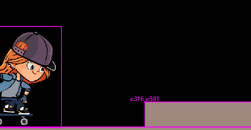

# Girl Skater

## Web Demonstration

https://codetricity.github.io/girl_skater/

## Project Learning Objectives

* practice using Flame 1.1 collision detection
  * use intersection points
* use velocity, gravity, ground friction
* use Tiled for platform maps

## Collision Detection Changes from Flame 1.0 to 1.1

https://docs.flame-engine.org/1.1.0/flame/collision_detection.html#migration-from-the-collision-detection-system-in-v1-0

## Credits

* skater girl - https://opengameart.org/content/skater-girl-2d-game-character-demo