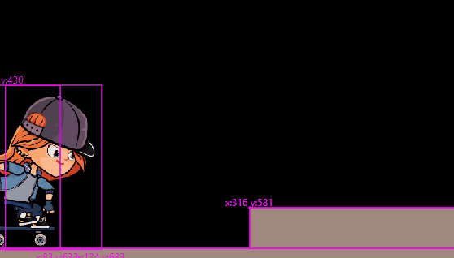

# Girl Skater



## Web Demonstration

https://codetricity.github.io/girl_skater/

## Project Learning Objectives

* practice using Flame 1.1 collision detection
  * use intersection points
* use velocity, gravity, ground friction
* use Tiled for platform maps

### Moving Down

To fall down, velocity is added to the position of the skater in the update loop.

```dart
y += velocity.y * dt;
```

## Gravity Acceleration

Velocity increases every time through the loop.  Add gravity to velocity.
If the y velocity is negative, the actor is moving up.
If gravity is added to a negative velocity, the actor will slow down.

```dart
final double gravity = 1.8;
...
...
velocity.y += gravity;
```

If y velocity is 0, stop adding gravity.

```dart
if (velocity.y != 0 || isJumping) {
  velocity.y += gameRef.gravity;
}
```

## Collision Detection Changes from Flame 1.0 to 1.1

https://docs.flame-engine.org/1.1.0/flame/collision_detection.html#migration-from-the-collision-detection-system-in-v1-0


## Credits

* skater girl - https://opengameart.org/content/skater-girl-2d-game-character-demo